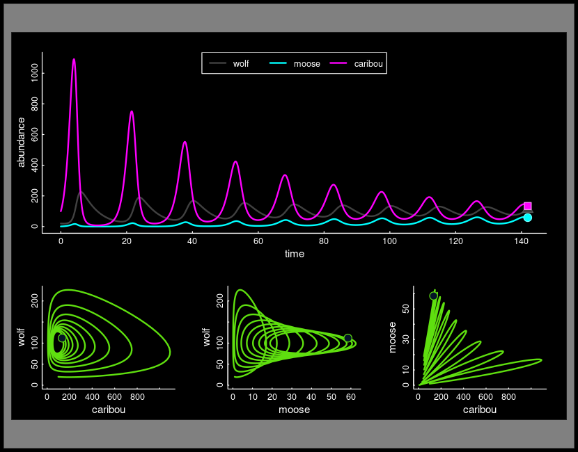

```{r, echo=FALSE, eval = TRUE}
htmltools::img(src = "assets/ESFStacked_FullColor.png", alt = 'banner', style = 'position:absolute; top:0; right:0; padding:0px; width:150px')
```



    

> The study of the rise and fall of populations, inter- and intraspecific  interactions - with a strong flavor of conservation biology and management. 

## Course Info

**Instructors:**

- **Eliezer (Elie) Gurarie** · [egurarie@esf.edu](mailto:egurarie@esf.edu) · Illick 206 · Office hours: W 2:15–3:15  
- **Joshua Drew** · [jadrew@esf.edu](mailto:jadrew@esf.edu) · Illick 343 · Office hours: W 2:15–3:15  

**TAs:**

- **Kate Henderson** · [Kahender@syr.edu](mailto:Kahender@syr.edu) · Illick 453 · Office hours: Th 3:00–4:00  
- **Gabi Pereira** · [glpereir@syr.edu](mailto:glpereir@syr.edu)

**Schedule:**

- **Lecture:** MW 12:45–2:05 · Baker 145  
- **Recitation:** Th 5:00–6:20 · Baker 309, 314
- **Graduate Session:** Th 3:00–4:00 · Illick 8  


# Course Materials

This course is co-taught by Drs. Drew and Gurarie. This page compiles the lectures, labs, problem sets and links to simulation tools for *Dr. Gurarie’s* portion of the course (roughly weeks 5-11). The page will be populated as the course progresses.


## Lectures

#### Topic I.  Exponential Growth

Readings:  **Gotelli Chapter 1** (on Blackboard)

- [1: Basic Models](lectures/ModuleI/ExponentialGrowth_PartI.html)
- [2: Linear Models for Exponential Growth](lectures/ModuleI/ExponentialGrowth_PartII_linearmodels.html)

<!--
- [3: Stochasticity](lectures/ModuleI/ExponentialGrowthWithStochasticity.html)
- [3b: Demographic Stochasticity Example: New Zealand Birds](lectures/ModuleI/DemographicStochasticityExample.pdf)


#### Topic II.  Limits to Growth

- [4: Limits to Growth - Part I](lectures/ModuleII/LogisticGrowth_PartI.html)
- [5: Limits to Growth - Part II](lectures/ModuleII/LogisticGrowth_PartII.html)


#### Topic III.  Structured Populations

- [6: Part I - Mainly Matrix Models](lectures/ModuleIII/PopulationStructure_PartI.html)
- [6b: Matrix Models - A few more slides](lectures/ModuleIII/StructuredPopulations_MiscellaneousSlides.pdf)
- [7: Part II - Life-History Tables](lectures/ModuleIII/PopulationStructure_PartII.html)

#### Topic IV.  Metapopulations

- [8: Metapopulations I](lectures/ModuleIV/Metapopulations_PartI.html)
- [9: Metapopulations II](lectures/ModuleIV/Metapopulations_PartII.html)


#### Topic V. Multi-Species Interactions

- [11: Competition and Coexistence](lectures/ModuleV/Interactions_PartI_Competition.html)
- [12: Competition and Predation](lectures/ModuleV/Interactions_PartII_CompetitionAndPredation.html)
- [13: Functional Responses](lectures/ModuleV/Interactions_PartIII_FunctionalResponses.html)
--> 

## Recitation/Labs

Many of our labs will use the R programming language.  If you use your own computer, be sure to download these two extremely useful (& extremely free) programs: [**R**](https://cran.r-project.org/) and [**Rstudio**](https://posit.co/download/rstudio-desktop/).  

- [Lab II.1: Introduction to R](labs/labII.1/IntroToR.html)

<!--
- [Lab II.2: Linear modeling for population growth](labs/labII.2/RandomnessAndLinearModels.html)
- [Lab II.3: Fitting Logistic growth](labs/labII.3/FittingLogisticGrowth.html)
- [Lab II.4: Structured Populations](labs/labII.4/AgeStructuredPopulations.html)
- [Lab II.5: Charismatic Competition](labs/labII.5/CharismaticCompetition.html)
- [Lab II.6: Competition and Predation and Competition, Oh My!](labs/labII.6/OnePredatorTwoPrey.html)
-->


## Problem Sets / Homework

- [HW 3: Exponential Growth](problemsets/ProblemSet3.html)  - Due **Thursday, Feb 26  **

<!--
- [HW 4: Logistic Growth](problemsets/ProblemSet4/FittingHumanWolves.html)  - Due **Thursday March 6**
- [HW 5: Structured Populations](labs/labII.4/AgeStructuredPopulations.html#Homework_Assignment))  - Due **Thursday March 20**
- [HW 6: Competition](problemsets/ProblemSet6/ProblemSet6.html)  - Due **Thursday April 3**
- [HW 7: Multi-Prey Mayhem](problemsets/ProblemSet7/ProblemSet7_MultiPreyMayhem.html)  - Due **Thursday April 11**
--> 

## Interactive Analysis Tools

- [1. Stochastic population simulator](https://egurarie.shinyapps.io/StochasticGrowth/)

<!--
- [2. Discrete logistic population simulator](https://egurarie.shinyapps.io/DiscreteLogisticMapping)
- [3. Life history table](https://egurarie.shinyapps.io/AgeStructuredGrowth)
- [4. Matrix Modeller 5000](https://egurarie.shinyapps.io/MatrixPopulationModels/)
- [5. Metapopulation Modeller 3000XC](https://egurarie.shinyapps.io/04_Metapopulations/)
- [6. Squirlicorn vs. Pegamunk: The Final Chapter](https://egurarie.shinyapps.io/SquirlicornVsPegamunk/)
- [7. Messing with Isoclines](https://egurarie.shinyapps.io/isoclines/)
- [8. Predator and Prey](https://egurarie.shinyapps.io/predatorprey/)
--> 

## Archives 

Archived materials for this class from Spring 2025 can be found [here](archive2024/index.html). 
