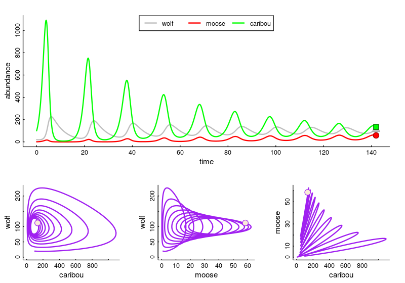

```{r, echo=FALSE, eval = TRUE}
htmltools::img(src = "assets/ESFStacked_FullColor.png", alt = 'banner', style = 'position:absolute; top:0; right:0; padding:10px; width:150px')
```



> The study of the rise and fall of populations, inter- and intraspecific  interactions - with a strong flavor of conservation biology and management. 


### Course Materials

This course is co-taught by Drs. [Elie Gurarie](https://www.esf.edu/faculty/gurarie/) and [Joshua Drew](https://www.esf.edu/faculty/drew/).   This page compiles the lectures, labs, problem sets and links to simulation tools for **Dr. Gurarie's** portion of the course (roughly weeks 5-11).  The page will be populated as the course progresses, but a link to previous year's [archives](archive2024/index.html) is below.  

## Lectures

#### Topic I.  Exponential Growth

- [1: Basic Models](lectures/ModuleI/ExponentialGrowth_PartI.html)
- [2: Linear Models for Exponential Growth](lectures/ModuleI/LinearModelsForExponentialGrowth.html)
- [3: Stochasticity](lectures/ModuleI/ExponentialGrowthWithStochasticity.html)
- [3b: Demographic Stochasticity Example: New Zealand Birds](lectures/ModuleI/DemographicStochasticityExample.pdf)


#### Topic II.  Limits to Growth

- [4: Limits to Growth - Part I](lectures/ModuleII/LogisticGrowth_PartI.html)
- [5: Limits to Growth - Part II](lectures/ModuleII/LogisticGrowth_PartII.html)

## Recitation/Labs

Many of our labs will use the R programming language.  If you use your own computer, be sure to download these two extremely useful (& extremely free) programs: [**R**](https://cran.r-project.org/) and [**Rstudio**](https://posit.co/download/rstudio-desktop/).  

- [Lab II.1: Introduction to R](labs/labII.1/IntroToR.html)
- [Lab II.2: Linear modeling for population growth](labs/labII.2/RandomnessAndLinearModels.html)
- [Lab III.3: Fitting Logistic growth](labs/labII.3/FittingLogisticGrowth.html)


## Problem Sets / Homework

- [HW 3: Exponential Growth](problemsets/ProblemSet3.html)  - Due **Thursday, Feb 27**

<!--
instructions:
git push origin gh-pages

Or, to merge with (non-existent) main:
1. git checkout gh-pages
2. git merge main
3. git checkout main
--> 

## Archives 

Archived materials for this class from Spring 2024 can be found [here](archive2024/index.html). 
