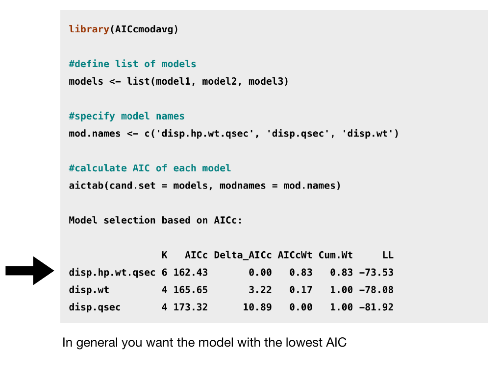
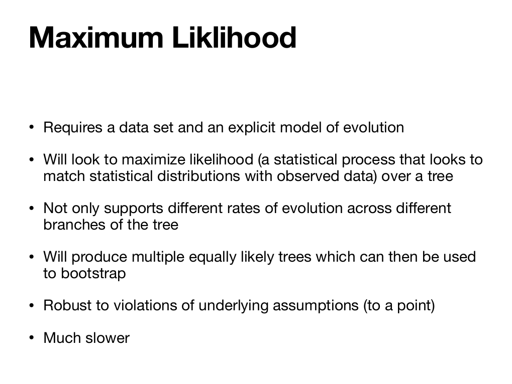

```{r setup, include=FALSE}
knitr::opts_chunk$set(echo = FALSE)
```


```{r colsFunction, echo = FALSE}
cols <- function(side = "l", w = 50){
  side <- ifelse(side == "l", "left", "right")
  cat(paste0('<div style="float:', side, '; width: ', w, '%;">'))
}
```

## A few slides from Lecture 6

<center>

 
</center>


What is a **Likelihood**?  
What is a **Maximum Likelihood Estimate**?  
What is **AIC**?  
What does this have to do with **model selection** and **parsimony**? 

## An example!


```{r results = "asis"}
cols("l")
```
 
### Oakie Island 

 

</div>

```{r results = "asis"}
cols("r")
```

### Orange Island

 
</div>


## little known fact ...

```{r results = "asis"}
cols("l",40)
```

your professor once played in a band called the Black Squirrels.  

</div>

```{r results = "asis"}
cols("r")
```

 

</div>

## The question: 


```{r results = "asis"}
cols("l")
```
 
### Oakie Island 

 

</div>

```{r results = "asis"}
cols("r")
```

### Orange Island

 
</div>

> What is the "best" model for squirrel morph distribution? 


## Data and Models 

```{r results = "asis"}
cols()
```

### Data / observations: $X_{ij}$

| island | a. Orange | b.  Oakie|
|---|---|---|
| squirrel 1 | $X_{a,1}$ = light | $X_{b,1}$ =light |
| squirrel 2 | $X_{a,2}$ = light | $X_{b,2}$ dark |

</div>

```{r results = "asis"}
cols("r")
```

### Models = Hypotheses

|model | n. parameters|
|---|---|
| M1: $P(X_{ij} = light) = p = 0.5$ | 1
| M2: $p = 0.75$ | 1
| M3: $p_a = 1$; $p_b = .5$ | 2
| M4: $p_{a,1} = 1;\,\,\, p_{b,1} = 1 \\ p_{a,2} = 1;\,\,\, p_{b,2} = 0$ | 4

</div>


## Likelihoood (of a model)

**Product** of **probabilities** of **data** given **model**.

$${\cal L}(model) = \prod_{i = 1}^n Pr(X | model)$$


- We **never** care about the **absolute** value of the likelihood! 
- Only the *relative* value of the likelihood. 


## Squirrel Models:

| model | likelihood | |
|---|---|---|
| M1: $p = 0.5$ | ${1\over2} \times {1\over2} \times {1\over2} \times {1\over2} = {1 \over 16}$ | 0.0625 |
| M2: $p = 0.75$ | ${3\over4} \times {3\over4} \times {3\over4} \times {1\over4} = {27 \over 256}$ | 0.1055 |
| M3: $p_a = .5$; $p_b = 1$ | $1\times1\times{1\over2}\times{1\over2} = {1\over 4}$ | 0.25 |
| M4: $p_{a,1} = 1;\,\,\, p_{b,1} = 1 \\ p_{a,2} = 1;\,\,\, p_{b,2} = 0$ | $1\times1\times1\times1$ | 1 |


$$\cal{L}(M4) > \cal{L}(M3) > \cal{L}(M2) > \cal{L}(M1)$$


## A(kaike) Information Criterion

A good fit is great!  But it is useless if it uses too much information (too many parameters).  This is *overfitting*.  One parameter per data point is TOO MANY parameters!


```{r results = "asis"}
cols()
```

 

Hirotugo Akaike 赤池 弘次 (1927-2006)
</div>


```{r results = "asis"}
cols("r")
```

Simple formula: 

$$AIC = -2 \log({\cal L})+ 2k$$

(where $k$ is the number of parameters)

- Better fit = higher $\cal L$ = lower AIC.  
- Too complicated = more k = higher AIC. 

**Lowest AIC is "best" model**

## Compute AIC 

| model | likelihood | log-likelihood | k | AIC
|---|---|---|---|---|
| M1: |  0.0625 | -2.77 | 1 | 7.55
| M2: | 0.1055  | -2.25 | 1 | **6.50**
| M3: | 0.25    | -1.39 | 2 | 6.77
| M4: | 1       | 0     | 4 | 8


<center>
AIC~2~ < AIC~3~ < AIC~1~ < AIC~4~

Most *parsimonious* model is M2!
</centeR>

## Compute AIC in R 

```{r, eval = TRUE, echo = TRUE}
L <- c(1/2^4, 27/256, 1/4, 1)
k <- c(1,1,2,4)

data.frame(L, k, AIC = - 2 * log(L) + 2 * k)
```

## Let's add one more observation ...
```{r results = "asis"}
cols()
```
 
### Oakie Island 

 

</div>

```{r results = "asis"}
cols("r")
```

### Orange Island

 

</div>

$$X_{b,3} = dark$$


## Updated squirrel models:

 model | probs | ${\cal L} = \Pi P(X|M)$ | ${\cal L}$ | k |  AIC|
---|---|---|---|---|---|
 M1 | $p = {1\over2}$ | ${1\over2} \times {1\over2} \times {1\over2} \times {1\over2} \times {1\over2}$ | 0.03125 | 1 | 8.93
 M2 | $p = {3\over 4}$ | ${3\over4} \times {3\over4} \times {3\over4} \times {1\over4} \times {1\over4}$ | 0.02637 | 1 | 9.27
 M2b | $p = {3\over 5}$ | ${3\over5} \times {3\over5} \times {3\over5} \times {2\over5} \times {2\over5}$ | 0.0346 | 1 | 8.73
 M3 | $p_a = .5; p_b = 1$ | $1\times1\times{1\over2}\times{1\over2}\times0$ | 0 (!!) | 2 | $\infty$
 M3b | $p_a = {1\over2}; p_b = {2\over3}$ | ${1\over2} \times {1\over2} \times {2\over3} \times {2\over3} \times {1\over3}$ | 0.037 | 2 | 10.6

```{r, eval = FALSE}
X <- c(1,0,1,1,0)
p1 <- .5
p2 <- 3/4
p2b <- 3/5
p3b <- c(rep(1/2,2), rep(2/3,3))

Ps <- list(
    P1 = ifelse(X, p1, 1- p1),
    P2 = ifelse(X, p2, 1- p2),
    P2b = ifelse(X, p3, 1- p2b),
    P3 = 0,
    P3b = ifelse(X, p3b, 1 - p3b))

L = sapply(Ps, prod)
k <- c(1,1,1,2,2)
data.frame(L, k, AIC = -2*log(L) + 2*k)
```


## Updated (1 parameter) squirrel models:

$\widehat p = 3/5$ is the **maximum likelihood estimate** of the probability that a squirrel is light morph.  


```{r, results = "asis"}
cols()
```


 model | probs | ${\cal L} = \Pi P(X|M)$ | ${\cal L}$ 
---|---|---|---|
 M1 | $p = {1\over2}$ | ${1\over2} \times {1\over2} \times {1\over2} \times {1\over2} \times {1\over2}$ | 0.03125 
 M2 | $p = {3\over 4}$ | ${3\over4} \times {3\over4} \times {3\over4} \times {1\over4} \times {1\over4}$ | 0.02637 
 M2b | $p = {3\over 5}$ | ${3\over5} \times {3\over5} \times {3\over5} \times {2\over5} \times {2\over5}$ | 0.0346 

</div>

```{r, results = "asis"}
cols("r")
```


```{r, eval = TRUE, fig.width = 5}
par(bty = "l", tck = 0.02, mgp = c(1.1,.25,0), cex.lab = 1.1, mar = c(3,3,1,1))
ps <- seq(0,1, .01)
X <- c(1,0,1,1,0)
getL <- function(p, X) prod(ifelse(X, p, 1- p))

plot(ps, sapply(ps, getL, X), type = "l", ylab = "Likelihood", xlab = "probability estimate")
abline(v = c(1/2, 3/5, 3/4), col = 2:4, lwd = c(1,2,1))
points(c(1/2, 3/5, 3/4), sapply(c(1/2, 3/5, 3/4), getL, X), pch = 19, cex = c(1,2,1), col = 2:4)
```

</div>


##  **Likelihoods** are the ***SOUL of INFERENCE***! {.smaller}


```{r, results = "asis"}
cols("l")
```

They allow you to FIT models (i.e estimate **parameters**) via maximization;

They are essential for **model selection**, e.g. with AIC;

They underlie **Bayesian approaches**;

They are used **throughout** Ecology!  

- **Phylogenies**, **Coalescence Trees**
- **Population dynamics**
- **Species Distributions**
- **Habitat Selection**
- **Movement Ecology** 
- **Survival Analysis**
- and on and on and on and on and on


</div> 

```{r, results = "asis"}
cols("r")
```


</div> 
