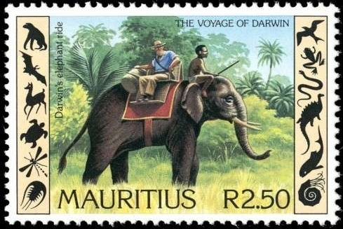

```{r setup, include=FALSE}
knitr::opts_chunk$set(echo = FALSE, message = FALSE, warning = FALSE)
#output: html_document
```


```{r colsFunction, echo = FALSE}
cols <- function(side = "l", w = 50){
  side <- ifelse(side == "l", "left", "right")
  cat(paste0('<div style="float:', side, '; width: ', w, '%;">'))
}
```

## Meet ... *Enhydra lutris*

<div class="columns-2">


>- Cute! (but are they *really*!?)
>- Furry! (guess how may hairs per in^2^? ... (*hint, humans are born with  ~100,000 total*)
>- **150,000 hairs / cm^2^** (>1,000,000 / in^2^)
</div>

## Sea otters: Keystone Species
 

(Estes et al. 1974)

## Sea otters: Range

<div class="columns-2">

  

  - Entire (*littorally*) North Pacific

</div>

## Sea otters: Furriness > Cuteness

<div class="columns-2">

  
  
  - Fur trade (Russian -> British -> American) leads to near **extirpation** across the entire range.
  - > 300,000 in 1740 ... < 2,000 in 1900.  
  - Displacement and indenturing of Indigeneous fishermen (esp. Aleut)
  


 
*... the rush for the otters’ “soft gold” was a predictable boom and bust cycle, a cautionary example of unsustainable resource use, and a socioeconomic driver of Western—mainly American—involvement in the Pacific region starting in the eighteenth century.*  (Loshbaugh 2021)

</div>


## Sea otters: curiously not totemic

<div style="float:left; width: 70%;">
 
 

*art by John Livingston*

</div>
<div style="float:right; width: 30%;">

- Ainu - Esaman
- Aleut - Chngatux
- Alutiiq - Arhnaq
- Tlingit - Yáxwchʼ
- Haida - Ku
- Nuu chah nulth - Кwak̕aƛ 
- Siletz - Elakha

## Sea otters: But culturally significant
 
<iframe src="https://www.youtube.com/embed/ZyYH4KBHKU4?controls=0" width="100" height="50%">
</iframe>

See: https://www.youtube.com/watch?v=ZyYH4KBHKU4

## Sea otter reintroduction: Pacific NW

Remnant populations from Aleutian Islands ... released in OR, WA, BC and SE-AK  1969 – 1972. 

<center>


</center>

## Sea otter reintroduction: Washington State ... 

<div style="float:left; width: 50%;">

</div>

<div style="float:right; width: 40%;">

```{r fig.width = 4, fig.height = 4}
WA <- read.csv("data/WA_SeaOtters_PopGrowth.csv")
require(ggplot2)
ggplot(WA, aes(year, count)) + geom_path(col = "grey") + geom_point()
```

<center>
***Successful!***
</center>

</div>

## Population ecology is all about ... {.build}

<center>
 $\huge N$ 
</center>

- but where?  when? 

## Here! Now! ... {.build}

<center>
$\huge N_t$
</center>

- but how many were there? 

## That many, then ($\Delta t$ ago)!

$$\Large N_t = N_{t - \Delta t} + \Delta N$$

slight rearrangement:

$$\Large N_{t+1} = N_t + \Delta N$$
For now, we just $\Delta t = 1$, i.e. it's the discrete unit that we measure population change.  VERY TYPICALLY - whether because of biology or field seasons:  $$\Delta t = 1\,\, \textrm{year}$$. 


## How does population change?

<center>
$\Large N_{t+1} = N_t + (B - D) + (I - E)$
</center>


### **B**irth
### **D**eath
### **I**mmigration
### **E**migration 


## Assumption 1: No one's getting on or off the bus

<center>
$\Large N_{t+1} = N_t + B - D$
</center>

### **B**irth
### **D**eath

### <font color = "red"><s>**I**mmigration</s>
### <s>**E**migration</s> </font>

This is a **closed** population ... and what we will be (mainly) dealing with for the next 3 weeks. 

## Assumption 2: the important one {.small}

The number of *Births* and *Deaths* is proportional to *N*.

$$\Large N_{t+1} = N_t + bN_t - dN_t$$
What does that mean? 

<div style="float:left; width: 50%;">
>- Every female gives birth to the same number of offspring? 
>- Every female has the same *probability* of giving birth?  
>- Every female has the same *probability* of giving birth to the same *distribution* of offspring? 

</div>

<div style="float:right; width: 50%;">

>- A fixed proportion of all individuals dies? 
>- Every individual has the same *probability* of dying? 
>- the *distribution* of probabilities of dying is constant? 

</div>


## Some math ....

Redefine $\lambda = b - d:$

$$N_{t+1} = N_t + r_0 N_t$$
$$N_{t+1} = (1 + r_0) N_t$$

$r_0$ intrinsic growth, i.e. proportion increase per unit time).  

$$N_{t+1} = \lambda N_t$$

## Cranking this forward {.large}

$$N_{t+1} = \lambda(N_t)$$
$$N_{t+2} = \lambda(N_{t+1}) = \lambda^2 N_t$$
$$N_{t+3} = \lambda^3 N_t$$

Solution:

$$\large N_{t+y} = \lambda^y N_t$$
<center>
***Geometric*** (same as ***Exponential***) growth. 
</center>


## Exponential growth can be very very very fast

https://www.youtube.com/watch?v=0fKBhvDjuy0


## Discrete Model to Continuous Model

Let's do some trickery, starting with:
$$N_{t+1} = (1 + r_0) N_t$$
$$N_{t+1} - N_t = r_0 N_t$$
$$N_{t+\Delta t} - N_t = r_{\Delta t} N_t$$

$$\lim_{\Delta t \to 0} {\Delta N \over \Delta t} =  \lim_{\Delta t \to 0}  {r_{\Delta t} \over \Delta t} N$$

Magically define: ${r_\Delta \over \Delta t} = r$ and rewrite $\Delta$ as $d$:

$$\large {dN \over dt} = r N$$


## Solving this *differential equation* ...      

<center>
${dN \over dt} = r N$ where $N(t = 0) = N_0$
</center>

```{r, results = "asis", echo = FALSE}
cols("l")
```


**Calculate:**

$\begin{align}
    {1\over N} dN &= r dt \\
    \int_{t' = t_0}^t {1 \over N(t)} dN &= \int_{t' = t_0}^t r dt  \\
    \log(N) &= rt + C_0 \\
    N &= e^{rt + C_0} \\
\end{align}$

</div>

```{r, results = "asis", echo = FALSE}
cols("r")
```
**Solution:**

Plug in: $$N(0) = N_0\\$$
$$ N(t) = N_0 e^{rt}$$


</div>


## Discrete vs. Continuous Modeling

```{r, results = "asis", echo = FALSE}
cols("l")
```

**Difference equations**
$$N_{t+\Delta t}  - N_t = \lambda_{\Delta t} N_t$$

think of *absolute change*

**Pros:**

- Reflects (often) biological reproduction patterns, practical sampling schedule (esp. annual)
- Intuitive 

**Cons:**

- Depends on discretization timescale
- Analytically surprisingly difficult to analyze

</div>

```{r, results = "asis", echo = FALSE}
cols("r")
```

**Differential equations**
$${dN \over dt} = r N$$


think of *rates* (change/time).

**Pros**

- Easier "elegant" mathematical analysis
- Scales nicely

**Cons**

- Unbiological 
- Unintuitive

</div>

## Sea otter data: 

Source:

https://wdfw.wa.gov/species-habitats/species/enhydra-lutris-kenyoni#resources


Load data:

```{r}
WA <- read.csv("data/WA_SeaOtters_PopGrowth.csv")
head(WA)
```

## Plot Data:

```{r}
plot(WA)
```

## Fit a line

```{r}
plot(WA); abline(lm(count ~ year, data = WA))
```


## Plot on Log scale:

```{r}
plot(WA, log = "y")
```

## Fit linear model log-growth

```{r}
WA.growth <- lm(log(count) ~ I(year-1970), data = WA)
summary(WA.growth)
par(mfrow = c(1,2))
plot(WA.growth, 1:2)

#require(ggplot2)
#ggplot(WA, aes(year, count)) + geom_point() + geom_smooth(method = "glm", #family = "log")
```

## A little math:

$$\log(N_i) = \alpha + \beta \, Y_i$$
$$N_i = \exp(\alpha) \times \exp(\beta \, Y_i)$$
$$N_i = e^\alpha {e^\beta}^{Y_i}$$
$$N_i = N_0 \lambda ^ {Y_i}$$

where $N_0 = e^{\alpha} = e^{4.08} = 59.14$, and $\lambda = e^{\beta} = e^{0.07325} = 1.076$.  

SO ... percent rate of growth is about 7.6%!         


## Plot exponential growth

```{r}
plot(count~year, data = WA)
curve(59.14 * exp(0.07325 * (x-1970)), add = TRUE, col = 2, lwd = 2)
```


## Exponential Growth and Natural Selection {.small}

```{r results = "asis"}
cols("l",60)
```


> There is no exception to the rule that every organic being increases at so high a rate, that if not destroyed, the earth would soon be covered by the progeny of a single pair ... The elephant is reckoned to be the slowest breeder of all known animals, and I have taken some pains to estimate its probable minimum rate of natural increase: it will be under the mark to assume that it breeds when thirty years old, and goes on breeding till ninety years old, bringing forth three pairs of young in this interval; if this be so, at the end of the fifth century there would be alive fifteen million elephants, descended from the first pair.

Charles Darwin - Origin of Species

</div>

```{r results = "asis"}
cols("r",40)
```




</div>

## References

- J. A. Estes, J. F. Palmisano. 1974. Sea otters: Their role in structuring nearshore communities. Science 185, 1058–1060. 
- Smith et al. 2021. Behavioral responses across a mosaic of ecosystem
states restructure a sea otter–urchin trophic cascade. PNAS Mar 2021, 118 (11)
- Loshbaugh S. 2021. Sea Otters and the Maritime Fur Trade. In: Davis R.W., Pagano A.M. (eds) *Ethology and Behavioral Ecology of Sea Otters and Polar Bears. Ethology and Behavioral Ecology of Marine Mammals.*
- Gilkinson, A.K., Pearson, H.C., Weltz, F. and Davis, R.W., 2007. Photo‐identification of sea otters using nose scars. *The Journal of Wildlife Management*, 71(6), pp.2045-2051.