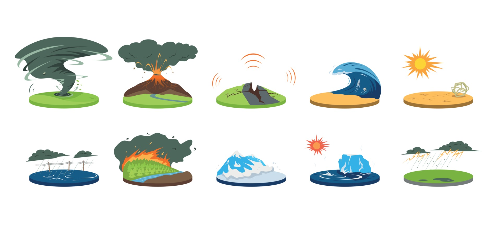
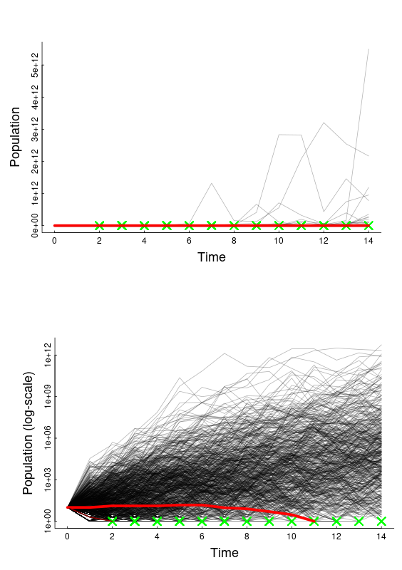

class:inverse

<!-- https://bookdown.org/yihui/rmarkdown/xaringan-format.html -->
```{r, echo = FALSE, eval = FALSE}
#renderthis::to_pdf("Lecture05_CountingAnimals_PartII.Rmd")
```

```{r setup, include=FALSE}
knitr::opts_chunk$set(echo = FALSE, message = FALSE, cache = TRUE, 
                      warning = FALSE, las = 1, dpi = 100)
#output: html_document
```


```{r xaringan-extras, echo=FALSE}
xaringanExtra::use_scribble()
xaringanExtra::use_tile_view()
```


```{r colsFunction, eval = FALSE}
setwd("D:/Box Sync/teaching/EFB370 - Population Ecology/2023/ModuleI_ExponentialGrowth")
system("cp images/raft3.jpg bg.jpg")
system("cp ../mycss.css ./")
xaringan::inf_mr()

```

```{r cache = FALSE}
require(kableExtra)
require(elieslides)
```


.pull-left.large[
## Goals (concepts / buzzwords)

- **I. Random variables:**

  - mean / variance / standard deviation / distributions / expected value
  
  - Binomial and Normal distributions
  
- II **stochastic** = randomness in time

  - **demographic stochasticity** = randomness in individual processes
  
  - **environmental stochasticity** = randomness affecting populations
]

.pull-right.large[
### Suggested reading: 

- Gotelli: Chapter 1 (second half)
]


---

## If the exponential model is so tidy ... why isn't it *perfect*?

.pull-left-50[
]


--

.pull-right[
## Because ... ***randomness!(?)***

*What are some potential sources of "randomness" in the sea otter population process?*

]

---

## If the exponential model is so tidy ... why isn't it *perfect*?

.pull-left-50[
]


.pull-right[
## Because ... ***randomness!(?)***

*What are some potential sources of "randomness" in the sea otter population process?*

>- Environment good / bad affecting all animals ...
>- Randomness in birth-death affecting individual animals ... 
>- Unexpected immigration / emigration ...
>- Observation error ...
]

---

## Brief Intro to Random Variables
.pull-left.large[
  Easiest problem in boring arithmetic:
  $$\huge 1 + 1 = 2$$
]

.pull-right.large[
Easiest problem in random arithmetic:
<br>
<br>
<center>
  $\huge +$   $\huge = ?$
</center>
]

---

## One coin flip is Random

.large[Random variables have *possible events* associated with *probabilities*. ]

event | numeric | probability 
:-----:|----|-----
 | $\Large 0$ | $\Large 1/2$
 | $\Large 1$ | $\Large 1/2$

---

## Two coin flips is also Random

Random variables have *possible events* associated with *probabilities*. 

event | numeric | probability 
:-----:|----|-----
 | $\Large 0$ | $\Large 1/4$
 $\,\,\Large \text{OR}\,\,$ | $\Large 1$ | $\Large 1/2$
 | $\Large 2$ | $\Large 1/4$

---

## Random variables... 

... are described by **Probability Distributions**.
**Probability Distributions** have **names** and **parameters** that describe the distribution. 

<center>
```{r fig.width = 6, fig.height = 2, out.width = "80%", dpi=200}
coinFlips <- function(n, p = 1/2, ...){
    x <- 0:n
    y <- dbinom(x, prob = p, size = n) 
    plot(x, y, cex = 3, ylab = "probability",
         type = "h", xlab = "possible values", xaxt = "n", 
         xlim = c(-.5, n + .5), ...)
    points(x, y, pch = 19, cex = 2)
    axis(1, at = 0:n)
}
pars(las = 1)
par(mfrow = c(1,3))
coinFlips(1, ylim = c(0,.6)); title("One coin flip")
coinFlips(2, ylim = c(0,.6)); title("Two coin flips")
coinFlips(10, ylim = c(0,.6)); title("Ten coin flips")
```
</center>

 
 
One flip | = | $X \sim Bernoulli(p = 1/2)$.  
---|---|---
**Two flips** | = | $X_1 + X_2 = Y \sim Binomial(p = 1/2, n=2)$.
** $n$ flips** | = | $\sum_{i=1}^n X_i = Y \sim Binomial(p = 1/2, n=n)$.

---

## A bit about the binomial distribution

.pull-left[
$X \sim Binomial(n, p)$ describes the sum of $n$ random events, each of which has probability $p$.  

### Pop ecology example:

If you have 20 sea otters ( $X_t = 20$ ), each with a 90% probability of survival / year, how many next year?

**Answer:** A random variable with distribution:  $X_{t+1} \sim Binomial(n = 20, p = 0.9)$
]

.pull-right[

```{r, fig.height = 5, out.width = "100%"}
pars()
coinFlips(20, 0.9)
```

]

---

## Key questions about a random variable:

$$X_{t+1} \sim Binomial(n = X_t,\,\, p = p_{surv})$$
.pull-left[
### Q1. How many would you *expect* to survive?

$$E(X) = \mu_X = np = 0.9 \times 20 = 18$$

This value is the **Expectation** of the distribution: $E(X)$ or $\mu(X)$.  It would be the *mean* value if you could repeat the experiment an infinite amount of times. 
]

.pull-right[
### Q2. How much *variability* is there in this process? 

$$SD(X) = \sigma_x = \sqrt{n\,p(1-p)} = 1.34$$
The **standard deviation** of a random variable: $SD(X)$ or $\sigma_x$ quantifies how concentrated the distribution is around the *mean*.  *Approximately* 95% of the probability is within 2 standard deviations. 
]

---

## Continuous random variables

There are a bunch. The most famous is the **Normal** or **Gaussian** distribution: 

$$X \sim {\cal N}(\mu, \sigma)$$

It has two parameters: $\mu$ and $\sigma$ with are - unsurprisingly - the *mean* (expectation) and *standard deviation* (spread) of the variable. 

.pull-left[

```{r, fig.height = 4, fig.width = 6, out.width = "100%"}
pars(); par(las = 1)
means <- c(0,1,-2)
sds <- c(1,1/2,2)
    
plot(c(-5,5),c(0,1), type = "n", main = "Three normal distributions", 
     ylab = "probability density", xlab = "possible values")
for(i in 1:3) curve(dnorm(x, means[i], sds[i]), add= TRUE, col = i, lwd = 2, n = 1e3)

legend("topleft", title = expression(N(mu, sigma)), 
       lwd = 2, col = 1:3, 
       legend = paste0("N(", means, ",", sds, ")"), bty = "n")
```
]

.pull-right[
```{r fig.height = 4, fig.width = 6, out.width = "100%"}
pars(); require(scales)
t.max <- 500
plot(1:t.max, ylim = c(-6,4), type = "n", ylab = "values", xlab = "times", 
     main = "Gaussian process in time (White Noise)")
for(i in 1:3)
    points(1:t.max, rnorm(t.max, means[i], sds[i]), col = alpha(i, .5), type = "o", pch = 19, cex= 0.5)
abline(h = means, col = 1:3, lwd = 2)
```
]

---

## Once upon a time in Germany ....


---

## Some probability distributions

We use these to **model** random processes: 

| name | notation | possible values | models | mean | standard deviation |
|----|----|---|---|---|---|
| Normal |   ${\cal N}(\mu, \sigma)$  | $(-\infty, \infty)$ | bell-shaped | $\mu$ | $\sigma$ |
| Exponential |  $Exp( \lambda)$  | $[0,\infty)$ | random events | ${1\over\lambda}$ | ${1 \over \lambda}$ | 
| Poisson |  $Poisson(\lambda)$  | $[0,\infty)$ | positive count data (e.g. births)| $\lambda$ | $\sqrt{\lambda}$ | 
| Bernoulli |  $Bernoulli(p)$  | $[0,1)$ | binary outcomes (e.g. deaths)| $p$ | $\sqrt{p(1-p)}$ | 
| Binomial |  $Binomial(n, p)$  | $[0,n)$ | many binary outcomes | $np$ | $\sqrt{n p(1-p)}$ | 

---

## Demographic Stochasticity

.large[
- ***Stochasticity*** means: **Randomness** in **time**.  

- ***Demography*** is the **Science of Population Dynamics**. Often it refers specifically to **births** and **deaths** (and **movements** ... but we're still looking at closed population). 

- Individually, *all* demographic processes are stochastic.  An individual has some *probability* of dying at any moment.  An individual has some *probability* of reproducting at a given time.

Q: How important is *individual* randomness for a *population* process?  

More specific Q: **What is the probability of extinction?**
]

---
class: inverse

## Human Experiment with Life and Death

.pull-left-60.large[

- 15 students

- Flip a survival coin.  

  - If you die (**TAILS**) sit down, if you live (**HEADS**) stay standing
  
- Flip a reproduction coin.  

  - If you reproduce (**HEADS**) call on another student to stand
]

.pull-right-40[]
  
---

## What do we predict from this experiment? 

Starting with $N_t$: expected number of survivors (S):
$$E(S) = p_s N_t$$
Expected number of new individuals (babies - B): 
$$E(B) = p_b E(S)$$ 

New population equals survivals + new babies:

$$E(N_{t+1}) = E(S) + E(B) = p_s N_t + p_b\,p_s N_t = p_s(1 + p_b) N_t$$
So (in our coin flip example) $$\widehat{\lambda} = p_s (1+p_b) = 0.75$$.   

.center[**What does that mean for population growth!?**]

---

## Cranking this experiment very many times. 

https://egurarie.shinyapps.io/StochasticGrowth/

.center[]


---

## Some predictions for a similar continuous model


.pull-left[
Assume birth rate $b$ and death rate $d$, and growth rate $r = b-d$. 

The mean of the process is also exponential growth

$$E(N_t) = N_0 e^{r t}$$
If birth rate = death rate: 

$$SD(N_t) \approx \sqrt{2 N_0 b t}$$

Note, increases as square root of time.  There's a somewhat more complex formula for births $\neq$ deaths. 
]

.pull-right[

More importantly: 

$$\begin{equation} P(extinction) = \begin{cases} \text{if}\,\,b > d;& (d/b)^{N_0}\\
\text{if} \,\, d > b;& 1 \end{cases} \end{equation}$$

Note that even when birth rate = death rate, $P(extinction) = 1$, i.e. eventual extinction is certain. This is very similar to the eventual probability of fixation for genetic drift. 

Also, probability of extinction is lower for smaller $N_0$. 
]

---

## Environmental Stochasticity...

.pull-left-40[

Some random aspect of the environment that influences .blue.large[***r***] (whether via .green[births] or .red[deaths] or **both**) for the **entire population**.:

$$R \sim Dist(\mu_r, \sigma_r)$$


- $\mu_r$ is the *mean growth rate*
- $\sigma_r$ is the *variability on the growth rate*
]

--

.pull-right-60[

> .darkred[**Can you think of some examples, e.g. for sea otters?**]

]


---

## Environmental Stochasticity...

.pull-left-40[

Some random aspect of the environment that influences .blue.large[***r***] (whether via .green[births] or .red[deaths] or **both**) for the **entire population**.:

$$R \sim Dist(\mu_r, \sigma_r)$$


- $\mu_r$ is the *mean growth rate*
- $\sigma_r$ is the *variability on the growth rate*
]


.pull-right-60[

> .darkred[**Can you think of some examples, e.g. for sea otters?**]



]

---
class: inverse

## Human Experiment

.pull-left-60.large[

The **professor** IS the **environment**!

1. $$\large N_0 = 16$$

2. If the environment flips **Heads**, the population doubles. 

3. If the environment flips **Tails**, the population halves. 
]


.pull-right-40[]
  

---

## Environmental Stochasticity: Analysis

.pull-left-40[

This model can be written:

$$N_{t+1} = N_t \, 2^{R}$$

Where $R$ is a random variable:

value | prob.
---|---
-1 | 1/2
+1 | 1/2
]

.pull-right[
$$E(R) = \mu_r = 0$$

So population should not grow, on average.

$$E(N(r)) = N_0 e^{\mu_r t} = N_0$$


And:

$$SD(R) = \sigma_R = 1$$
]

--

>- Are you doomed to extinction?  
>- Does this remind you of another process from earlier in class? 

.center[Experiment here: https://egurarie.shinyapps.io/StochasticGrowth]

---

## A stochastic population is a random variable!

.pull-left-40[

$$N(t) \sim Dist(\mu_N(t), \sigma_N(t))$$

The mean / expectation is the same as for the exponential growth function, but with the mean growth rate substituted:

$$\mu_N(t)= N_0 e^{\mu_r t}$$
But the standard deviation of the function increases with time!

$$\sigma^2_{N}(t) \approx N_0\,e^{\mu_r t} \sqrt{e^{\sigma_r^2t} - 1}$$
]

.pull-right-60[

Sea otter example, with $\mu_r = 0.07$ and $\sigma_r = 0.07$:


```{r fig.width = 5, fig.height = 3, dpi=200}
pars()
t_max <- 50
mu_r <- 0.07
sigma_r <- 0.07
N_0 <- 60

seaotterProcess <- function(j, t_max = 50, mu_r = 0.07, sigma_r = 0.07, N_0 = 60){
    r <- rnorm(t_max, mu_r, sigma_r)
    N <- rep(NA, t_max)
    N[1] <- N_0
    for(i in 2:t_max)
        N[i] <- N[i-1]*exp(r[i])
    return(N)
}

seaotterPredict <- function(t_max = 50, mu_r = 0.07, sigma_r = 0.07, N_0 = 60){
    mu_N <- N_0 * exp(mu_r*(1:t_max))
    sigma_N <- N_0 * exp(mu_r*(1:t_max)) * sqrt(exp(sigma_r^2*(1:t_max)) - 1)
    return(data.frame(mu_N, mu_N - sigma_N, mu_N + sigma_N))
}

N.hat <- seaotterPredict()

N.matrix <- apply(as.matrix(1:100, ncol = 100), 1, seaotterProcess)
par(mfrow = c(1,2))
matplot(N.matrix, type = "l", col = rgb(0,0,0,.2), 
        ylab = "Population", xlab = "Time", lty = 1)
lines(N.hat[,1], lwd = 2, col = "red")
lines(N.hat[,2], lwd = 1, col = "red")
lines(N.hat[,3], lwd = 1, col = "red")

matplot(N.matrix, type = "l", col = rgb(0,0,0,.2), log = "y", 
        ylab = "Population", xlab = "Time", lty = 1)
lines(N.hat[,1], lwd = 2, col = "red")
lines(N.hat[,2], lwd = 1, col = "red")
lines(N.hat[,3], lwd = 1, col = "red")
```

Grey lines are simulations.  Red lines are $\mu_N(t) \pm \sigma_N(t)$
]

---

.large.pull-left-60[

## If things are TOO random that spells trouble!

According to theory, if: 

.darkred[$$\sigma_r > 2\mu_r$$]

extinction is nearly certain - even if $\mu_r$ is positive and on average there is growth.  

> .center[Experiment here: https://egurarie.shinyapps.io/StochasticGrowth] 

]


.pull-right-40[
]

---
class: inverse

.pull-left-60.large[
## Key Takeaways

1. Nature is a combination of **very complex** and **truly random**.  So we have to get comfortable with randomness

1. **Demographic stochasticity** refers to **individual randomness**, and particularly effects **small populations**. 

2. **Environmental stochasticity** affects **everyone similarly**, **big** or **small** populations, and too much randomness bodes ILL. 
]


.pull-right-40[
.
]
