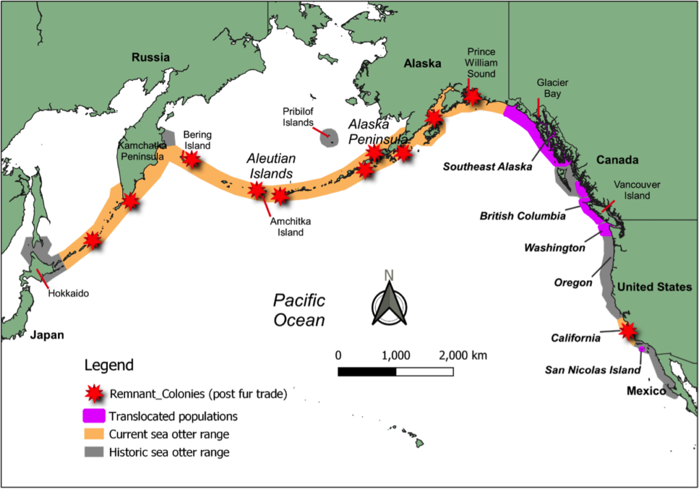
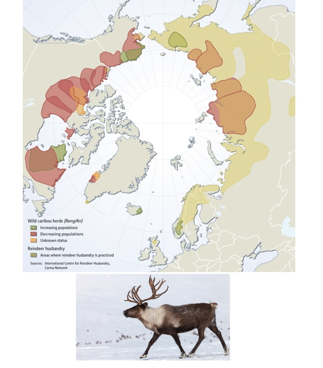
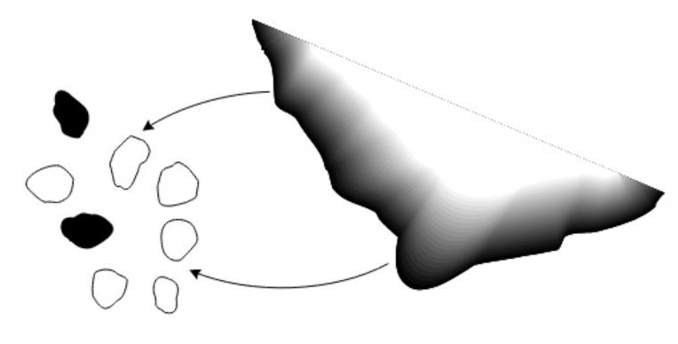
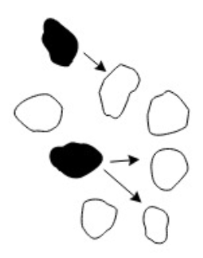

```{css echo = FALSE}
MathJax.Hub.Config({
  tex2jax: {
    inlineMath: [['$','$'], ['\\(','\\)']],
    processEscapes: true
  }
});
```

```{r setup, include=FALSE}
knitr::opts_chunk$set(echo = FALSE, message = FALSE, cache = TRUE, 
                      warning = FALSE, las = 1, dpi = 200)
options(htmltools.dir.version = FALSE, htmltools.preserve.raw = FALSE)
#output: html_document
```


```{r xaringan-scribble, echo=FALSE}
xaringanExtra::use_scribble()
```

```{r xaringan-tile-view, echo=FALSE}
xaringanExtra::use_tile_view()
```

```{r runningstuff, eval = FALSE}
system("cp images/glanville_frittilary.jpg bg.jpg")
system("cp ../mycss.css ./")
xaringan::inf_mr("Metapopulations_PartI.Rmd")
getwd()
```

```{r}
require(elieslides)
require(kableExtra)
```

<!--
## Goals

.pull-left[
Define ***metapopulation***

How does **metapopulation structure** influence **extinction**

Some theoretical models: 
- **External** and **Internal** colonization
- **Independent mortality** vs. **Rescue Effect**
]

.pull-right[Gotelli Chapter 4]
-->


## Blowing up $N_t$ in space


**Simple population:**  $$\large N(t)$$

**Age/stage-structured:**  $$\large N_i(t) = \{N_1(t), N_2(t), ..., N_k(t)\}$$

- where $i$ represents structure, with $k$ age/stage classes

**Spatial structure:** $$\large N_i(t) = \{N_1(t), N_2(t), ..., N_k(t)\}$$

- where $i$ is location, with $k$ locations

---
## .darkblue[A metapopulation is a **population of populations**]
.pull-left[

]

.pull-right.large[

1. The local populations MUST be somehow connected via **dispersal**.  

2. There must be areas of (near) zero density in between.  The "in-between" is referred to as the **matrix**.   

### Canonical examples

- **Fragmented habitats**

- Island populations
]


---

## **Population** vs. **Metapopulation** 

.pull-left-40.large[
**WA sea otters**

- Closed population

    - only **Birth** and **Death**

- Questions: 
    - growth | dynamics | age structures
    
- **Extinction** of interest mainly due to stochasticity, low numbers
]

.pull-right-50.large[

**ALL sea otters**

- Open population
    - **Immigration!**  **Emigration!**

- Questions: 

    - given that a local population might go **extinct**, will the metapopulation go **extinct**?
    
    - what is the proportion of occupied patches?
]

---

## What makes it a metapopulation?  **Dispersal distance**

.pull-left[


Sale, Hanski, Kritzer 2006
]

.pull-right.large[

As long as there is *some* local connectivity among populations. 




]

---


.pull-left-60[
## By that metric ...

### Polar bear (*Ursus maritimus*)


]

.pull-right-40[

### and caribou / reindeer (*Rangifer tarandus*)




.center[Are also **metapopulations**]
]


---

## Population persistence of a single population? 

.pull-left[

$e$ = *local* probability of extinction

time steps | Prob. persistence
---|--- 
1: | $1-e$
2: | $(1-e)(1-e)$
3: | $(1-e)(1-e)(1-e)$
4: |  $(1-e)(1-e)(1-e)(1-e)$
... | 
$t$: | $(1-e)^t$
]

.pull-right[
```{r localpersistence, fig.width = 6, fig.height = 5, out.width = "100%"}

plotPersistence <- function(k = 1, pes =  c(0,.05,.1,.2,.5, .8), 
                            tmax = 30, legend = FALSE,  
                            xlab = "time", ylab = "probability",
                            ...){
     require(gplots)
    palette(rich.colors(length(pes)))
    
    plot(c(0, tmax), 0:1, type ="n", xlab = xlab, ylab = ylab, ...)
    for(i in 1:length(pes))
        curve((1-pes[i]^k)^x, col = i, lwd = 2, add = TRUE)
    if(legend)
    legend("right", lwd = 2, col = 1:length(pes), 
           title = "e", legend = pes, bty = "n", bg = "grey")
}
pars()
   
plotPersistence(main = "probability of persistence", legend = TRUE)
```

**Take away:** Even with very LOW probability of extinction, you WILL go extinct.  
]


---

## **M0**: Population persistence of a **metapopulation**

.pull-left-40[

$k$ populations, $t$ time steps

Pops: | 1 time step|  *t* steps 
---|---|----
1: | $1-e$ | $(1-e)^t$
2: |  $1-e \times e$ | $(1-e^2)^t$
3: | $1-e \times e \times e$ | $(1-e^3)^t$
... | ... | ... 
k: | $1-e^k$ | $(1-e^k)^t$

]

.pull-right-60[


```{r, out.width = "100%", fig.height = 6}
pars()
par(mar = c(0,0,2,0), oma = c(4,4,2,2), mfrow = c(2,2))
plotPersistence(k  = 1, main = "k = 1", xaxt = "n", xlab = "", xpd = NA)
plotPersistence(k  = 2, main = "k = 2", xaxt = "n", yaxt = "n")
plotPersistence(k  = 3, main = "k = 3", xpd = NA)
plotPersistence(k  = 10, main = "k = 10", legend = TRUE, yaxt = "n", ylab = "", xpd= NA)
title("Population persistence", outer = TRUE, cex.main = 2)
```

]

---

## Metapopulations are resistant to extinction!

.pull-left-40[


$$\large P(k,t) = (1-e^k)^t$$


.darkblue[
Metapopulations **dramatically** spread out / buffer the risk of extinction!]

<center>

</center>

.darkred[
But still ... if the ONLY process is extinction, you **will go extinct** (sorry!)
]
]


.pull-right-60[


```{r, out.width = "100%", fig.height = 6}
pars()
par(mar = c(0,0,2,0), oma = c(4,4,2,2), mfrow = c(2,2))
plotPersistence(k  = 1, main = "k = 1", xaxt = "n", xlab = "", xpd = NA)
plotPersistence(k  = 2, main = "k = 2", xaxt = "n", yaxt = "n")
plotPersistence(k  = 3, main = "k = 3", xpd = NA)
plotPersistence(k  = 10, main = "k = 10", legend = TRUE, yaxt = "n", ylab = "", xpd= NA)
title("Population persistence", outer = TRUE, cex.main = 2)
```
]

---

## **M1:** Let's add **colonization**

.pull-left.large[

**Island-Mainland model**

- Every (local) population has a probability of going extinct: $p_e$

- But every empty location has a probability of getting colonized: $p_c$

> Note - there is an important (implicit) assumption that population very quickly hits **carrying capacity**, so essentially *instant* saturation.

]


.pull-right.large[



The mainland is a constant, independent source of potential colonizers. Also known as **propagule rain**. 

.green[(echoes of *biogeography*).]
]

---

## **M1:** Island-Mainland Model 

.pull-left[

### Q: How many occupied patches might we expect?

$$E(N_{t+1}) = N_t - p_e N_t + (K - N_t)\,p_c$$

define proportion of populated patches: $f_t = E(N_t)/K$, and define *equilibirum*:
$$f^* := f_{t+1} = f_t$$   

.center[*...then some math happens...*]

.red[$$\large f^* = {p_c \over p_c + p_e}$$]
]

.pull-right[


> The equilibrium is a balance between colonization and extinction rate. 

]

---

## Continuous time formulation

.pull-left-40[
Very general metapopulation model:

.red[

$$\huge {df \over dt} = c(f) - e(f)$$
]


Where *c* = colonization rate, *e8 = extinction rate. Can be (often are!) functions of $f$ (occupied proportion).  

.green[Note: this is similar to 
$$\large {dN \over dt} = b(N) - d(N).$$ 


which is the foundation of population growth models)
]]

.pull-right-50[

> #### Assumptions: 
> 
> - Deterministic (i.e. $k \to \infty$)
> - Continuous-time, unstructured extinction / colonization process
> - "Rates" are like infinitesemal probabilities


But - lots of elegant analyses can be made messing with this model. 
]

---


.pull-left[

## **M1:** Mainland-Island

.large.red[  $$\large {df \over dt} = c - e$$ ]

Colonization is constant, so proportional to **available** patches: 
$$c = p_c(1-f)$$ 

Extinction is constant, so proportional to **occupied** patches: 

$$e = p_e f$$

so: 
$$ {df \over dt} = p_c(1-f) - p_ef$$


]

.pull-right[


```{r IslandMainland, fig.height = 3, fig.width = 4, out.width = "100%"}
pars()
source("modelplots.R")
islandmainland(ylab = "colonization / extinction rate",
          xlab = "probability of incidence", xaxt = "n")
```

> The rate of change of the occupied patches GROWS in proportion to unoccupied patches and FALLS in proportion with occupied patches.

]


---

## **M2**: Internal Colonization

.red[$$\Large {df \over dt} = p_c f(1-f) - p_ef$$]


.pull-left-30[

]

.pull-right-60.large[

Extinction *rate* is constant, as before: 
$$e = p_e f$$

Colonization can only come from **occupied** patches: 
$$c = p_c \, f \, (1-f)$$ 

If no patch is colonized ( $f=0$ ), nothing can colonize.

If the population is 100% occupied ( $f = 1$ ), there is nothing to colonize. 
]

---


.pull-left[


## **M2**: Internal Colonization - with Schematic

.red[
$$ \large {df \over dt} = p_c f(1-f) - p_ef$$
]

Extinction is constant, as before: 
$$e = p_e f$$

Colonization can only come from **occupied** patches: 
$$c = p_c \, f \, (1-f)$$

.blue[The maximum rate of colonization occurs when $f = 1/2$. 

]

]

.pull-right[

```{r InternalColonization, fig.height = 4, fig.width = 5, out.width = "100%"}
pars()
source("modelplots.R")
internalcolonization(ylab = "colonization / extinction rate",
          xlab = "probability of incidence")
```

**Equilibrium** occurs when: 
.darkred[

$$f^* = \begin{cases} 1-p_e/p_c & \text{when} & p_e < p_c  \\ 0 & \text{when} & p_e \geq p_c\end{cases}$$ 

]]

---

## **M3:** Rescue Effect  

.red[
$$ \Large {df \over dt} = p_c (1-f) - p_ef(1-f)$$
]

.pull-left-40[

Assumes that if you have a lot of neighbors some loose "propagules" will buffer you from extinction. 

**Equilibrium states:** 

.darkred[

$$f^* = \begin{cases} p_c/p_e & \text{when} & p_e > p_c  \\ 1 & \text{when} & p_e \leq p_c\end{cases}$$ 

]

Even with higher extinction rate than colonization rate, there will always be some occupied patches!
]


.pull-right[


```{r RescueEffect, fig.height = 3, fig.width = 4, out.width = "100%"}
pars()
source("modelplots.R")
rescueeffect(ylab = "colonization / extinction rate",
          xlab = "probability of incidence")
```
]

---

## **M4:** Rescue Effect with Internal Colonization

<font color = "red">
$$ \large {df \over dt} = p_c f(1-f) - p_ef(1-f)$$
</font>


.pull-left[

Only equilibria: 0, if $p_e > p_c$ or 1, if $p_e \leq p_c$.  

Fundamental conclusions: 

> **metapopulation** under equilibrium MUST be rare! 
> Either everything colonizes or nothing colonizes.**
]

.pull-right[

```{r FinalSchematic, fig.height = 3, fig.width = 4, out.width = "100%"}
pars()
source("modelplots.R")
both(ylab = "colonization / extinction rate",
          xlab = "probability of incidence")
```
]


---

## Four models

 
<center>
```{r, fig.width = 8, fig.height = 5, out.width = "70%"}
pars()
source("modelplots.R")
par(mfrow = c(2,2), mar = c(0,0,2,0), oma = c(4,4,3,2))

islandmainland(ylab = "colonization / extinction rate", axis = FALSE, xaxt = "n")
title("External", col.main = "darkgreen")
mtext(side = 2, "Constant", col = "darkred", font = 2, line = .5)
internalcolonization(axis = FALSE)
title("Internal", col.main = "darkgreen")
rescueeffect(ylab = "colonization / extinction rate", xlab = "probability of incidence", label = FALSE)
mtext(side = 2, "Rescue Effect", col = "darkred", font = 2, line = .5)

both(xlab = "probability of incidence", label = FALSE)
mtext(side = 3, outer = TRUE, "Colonization", cex = 2, col = "darkgreen")
mtext(side = 2, outer = TRUE, "Extinction", cex = 2, col = "darkred", line = 2)
```

With rather different predictions!  (Nice synthesis -  mainly due to Gotelli.)


---

.pull-left-70[
## Some characters

### Richard Levins (1930-2016)


- "Scholarship that is indifferent to human suffering is immoral."
- "Our truth is the intersection of independent lies."
]

.pull-right-30[

### Ilkka Hanski (1953-2016)


]