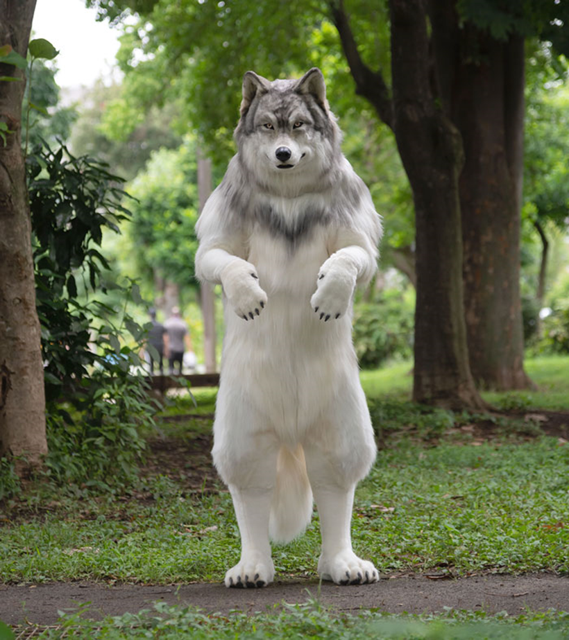

```{r setup, include=FALSE}
knitr::opts_chunk$set(echo = FALSE, eval = FALSE)
```

### Due date:  Thursday, March 6, 2025, 11:59 pm. 
### Total Points: 10

> <font color = "darkred"> ***Instructions:***  *Submit this homework as a document.  It can be entirely typed on a computer and uploaded on Blackboard, or completed as a combination of handwritten and printed (computer generated plots must be printed).  Answer questions in complete sentences and explain how you obtained your answers.  Only provide answers and include plots, do* **NOT** *send in code!  Collaboration and discussion - openly and on the discussion forum - is highly encouraged, but do not provide and publicize actual answers.* 
</font> 

In this assignment, you will fit the **logistic growth curve** to data on the human-wolf-simulation we collected last week, using the tools we practiced in the [Lab](https://eligurarie.github.io/EFB370/labs/labII.3/FittingLogisticGrowth.html). 

You will need to download this dataset: [WolfCounts2025.csv](WolfCounts2025.csv), which has seven columns: `Year` and then six more representing the TOTAL counts from the 5 biologists that monitored the human-wolf population and the self-reporting from 51 students.

Here's a plot of all the data:

```{r, echo = FALSE, eval = TRUE, fig.align = "center", fig.height = 5, fig.width = 7}
par(mar = c(3,3,2,2), bty = "l", mgp = c(1.5,.25,0), tck = 0.01, cex.lab = 1.2, las = 1)
wolf <- read.csv("WolfCounts2025.csv")

palette(gplots::rich.colors(6))

biologists <- names(wolf)[2:7]
plot(wolf[,2] ~ Year, data = wolf, type = "n", 
     ylim= c(0,max(wolf)), ylab = "total wolf count")
for(i in 1:length(biologists)){
  points(get(biologists[i]) ~ Year, data = wolf, col = i, type = "o", 
         pch = i + 14, cex = 1.5)
}
legend("topleft", legend = biologists, col = 1:6, pch = 15:20, title = "biologists")
```


### 1. (**1 pts**) 

Load the dataset, and select **one** of the five sets of observations from one of the biologists.  Plot that curve, and comment on its shape, i.e. does it look (a) linear, (b) exponential, (c) sigmoidal or something else? 


### 2. (**2 pts**) 

Fit a logistic curve to the data "by hand", i.e. using the logistic function we used in Part I of the lab. Report your best guess for $N_0$, $r_0$ and $K$.  Plot the fitted curve on the data in <font color = "blue"> blue </font>. 

### 3. (**3 pts**) 

Fit a logistic curve to the data using non-linear least squares. Report the *point estimates* and *95% Confidence Intervals* of the three parameters.  Plot the fitted curve on the data. Make the curve  <font color = "darkred"> red </font>.


### 4. (**4 pts**)

You know everything about the population ecology of this system.  Does your analysis suggest there is **density dependence** in this system?  If so, does it act on **birth rates** or **death rates** or both? Explain in detail!

### Extra Credit. (**3 pts**) 

Repeat Questions 1 and 3 for the self-reported data in the final column (make a plot, and fit a logistic curve using non-linear least squares). Report the *point estimates* and *95% Confidence Intervals* of the three parameters. How does this compare to your estimates from your results in #3?  Are some parameters more different than others?  Why do you think that this is the case?

<center>
 

**This is a very well-fitted human-wolf simulation.**
</center>

```{r, echo = FALSE, eval = FALSE}
englandwales <- read.csv("WolfCounts2025.csv")

N.logistic <- function(x, N0, K, r0) K/(1 + ((K - N0)/N0)*exp(-r0*x))

wolf.fit <- nls(Erin ~ N.logistic(Year, N0, K, r0), data = wolf[,c("Year","Erin")], 
    start = list(N0 = 4, K = 70, r0 = 1))

coefs <- summary(wolf.fit)$coef[,1]

{
  plot(Erin ~ Year, data = wolf, 
     ylim= c(0,50))
  curve(N.logistic(x, coefs["N0"], coefs["K"], coefs["r0"]), add = TRUE, col = "red")
}

# K.hat = 65.6;  
```
